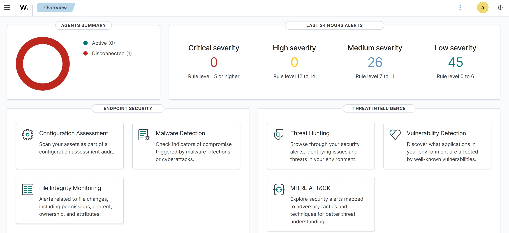
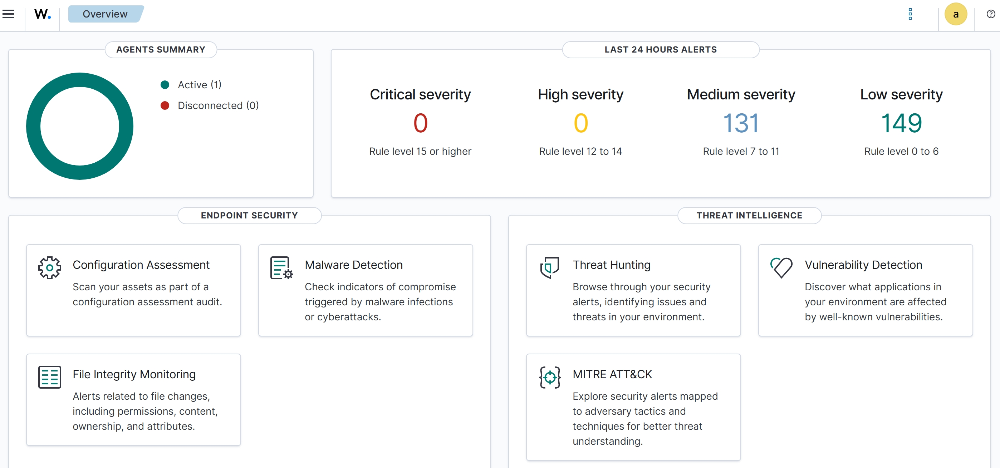
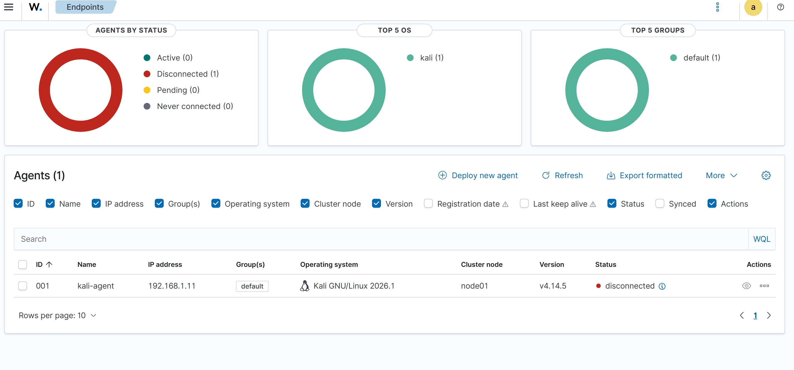
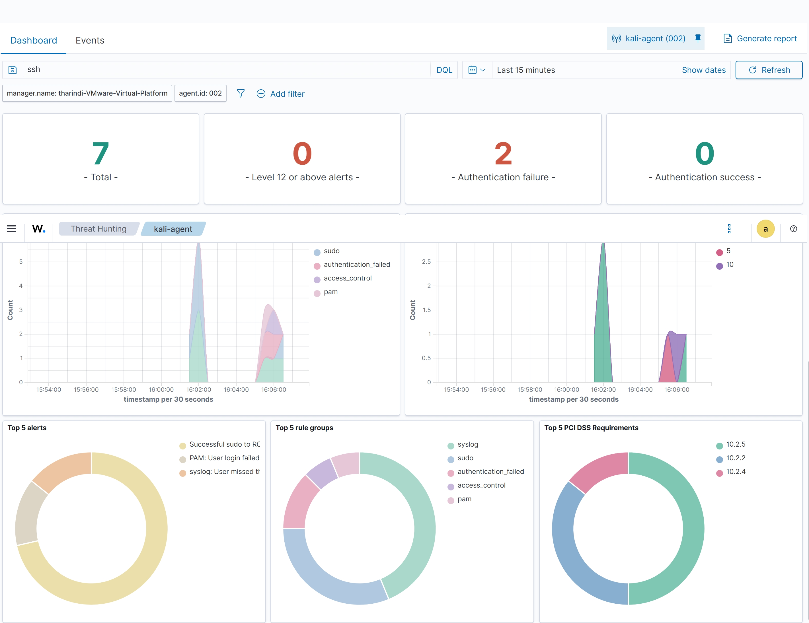
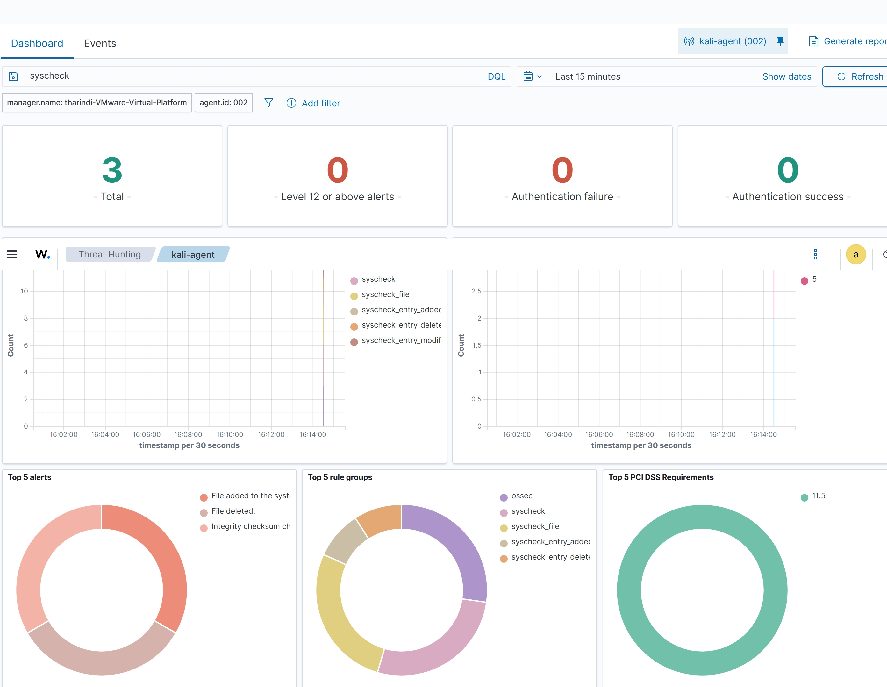
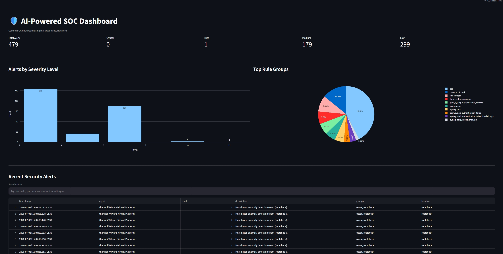
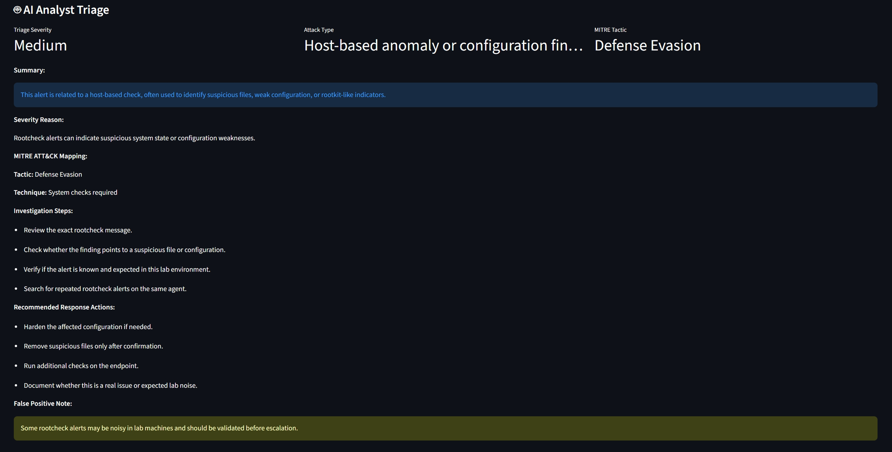
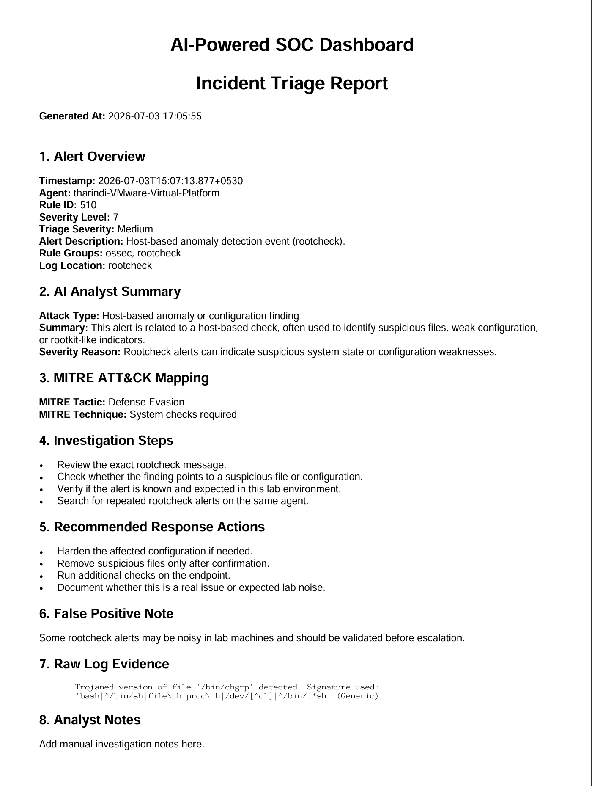

# 🛡️ AI-Powered SOC Dashboard

An AI-assisted Security Operations Center (SOC) dashboard built using **Wazuh**, **Python**, **Streamlit**, and **PDF incident report generation**.

This project simulates a small SOC environment where security alerts are collected from a monitored endpoint, displayed in a custom dashboard, analyzed using an AI-style SOC triage engine, mapped to MITRE ATT&CK concepts, and exported as PDF incident reports.

---

## 📌 Project Overview

The main goal of this project is to build a practical SOC dashboard that helps security analysts understand and investigate alerts more easily.

The dashboard reads real Wazuh security alerts from:

```text
/var/ossec/logs/alerts/alerts.json
```

Then it displays:

- Alert statistics
- Alert severity levels
- Recent security events
- Searchable alert table
- Alert details
- AI-style analyst triage
- MITRE ATT&CK mapping
- Investigation steps
- Recommended response actions
- False positive notes
- Downloadable PDF incident reports

---

## 🧠 Why I Built This Project

As a cybersecurity undergraduate, I wanted to build a project that connects real SOC concepts with modern AI-assisted security analysis.

This project helped me understand how a SOC dashboard works, how Wazuh collects alerts, how endpoint monitoring works, and how AI can support alert triage and incident response.

---

## 🏗️ Lab Architecture

```text
Kali Linux Endpoint
        ↓
Wazuh Agent
        ↓
Ubuntu Wazuh Server
        ↓
Wazuh Alerts JSON
        ↓
Custom Streamlit Dashboard
        ↓
AI Analyst Triage + PDF Incident Report
```

---

## ⚙️ Tools and Technologies Used

- Wazuh SIEM/XDR
- Wazuh Agent
- Ubuntu VM
- Kali Linux VM
- Python
- Streamlit
- Pandas
- Plotly
- ReportLab
- VS Code Remote SSH
- MITRE ATT&CK-based triage logic

---

## ✨ Key Features

- Real Wazuh alert monitoring
- Custom SOC dashboard
- Alert severity summary cards
- Alert visualization charts
- Recent security alerts table
- Search and filter functionality
- Alert detail inspection
- AI-style SOC analyst triage
- MITRE ATT&CK tactic and technique mapping
- Investigation steps for analysts
- Recommended response actions
- False positive explanation
- PDF incident report generation

---

## 🧪 Security Events Tested

The following lab security events were generated and analyzed:

- Failed sudo authentication attempts
- SSH failed login activity
- File Integrity Monitoring alerts
- File creation, modification, and deletion events
- Host-based rootcheck alerts

---

## 📸 Project Screenshots

### 1. Wazuh Dashboard Overview



---

### 2. Wazuh Agent Connected



---

### 3. First Security Alert



---

### 4. SSH Failed Login Alert



---

### 5. File Integrity Monitoring Alert



---

### 6. Custom SOC Dashboard



---

### 7. AI Analyst Triage



---

### 8. PDF Incident Report Output



---

## 🔍 How It Works

1. A Wazuh agent is installed on the Kali Linux endpoint.
2. The Wazuh agent collects security logs from Kali.
3. The Wazuh server analyzes those logs and generates alerts.
4. Alerts are saved in Wazuh’s `alerts.json` file.
5. The custom Streamlit dashboard reads the alert data.
6. The dashboard displays charts, tables, and alert details.
7. The triage engine explains the selected alert.
8. The alert is mapped to possible MITRE ATT&CK tactics and techniques.
9. The analyst can download a PDF incident report.

---

## 🤖 AI Analyst Triage

The dashboard includes an AI-style triage engine that explains alerts in a SOC analyst format.

For each selected alert, it provides:

- Alert summary
- Possible attack type
- Severity explanation
- MITRE ATT&CK tactic
- MITRE ATT&CK technique
- Investigation steps
- Recommended response actions
- False positive note

Example output:

```text
Attack Type: Possible SSH login attack

Summary:
This alert may indicate failed SSH login activity against a monitored Linux endpoint.

MITRE Tactic:
Credential Access

MITRE Technique:
Brute Force / Password Guessing
```

---

## 📄 PDF Incident Report Generator

The dashboard can generate a PDF incident report for a selected alert.

The PDF report includes:

- Alert overview
- Agent name
- Rule ID
- Severity level
- AI analyst summary
- MITRE ATT&CK mapping
- Investigation steps
- Recommended response actions
- False positive note
- Raw log evidence
- Analyst notes section

---

## 📁 Project Structure

```text
ai-powered-soc-dashboard/
├── app.py
├── triage.py
├── report.py
├── requirements.txt
├── README.md
├── .gitignore
├── assets/
│   └── screenshots/
│       ├── 01_wazuh_dashboard_overview.png
│       ├── 02_wazuh_agent_connected.png
│       ├── 03_first_security_alert.png
│       ├── 04_ssh_failed_login_alert.png
│       ├── 05_file_integrity_monitoring_alert.png
│       ├── 06_custom_soc_dashboard_v1.png
│       ├── 07_ai_triage_section.png
│       └── 08_incident_report_pdf_output.png
└── venv/
```

---

## 🚀 How to Run the Project

### 1. Clone the Repository

```bash
git clone https://github.com/YOUR_USERNAME/ai-powered-soc-dashboard.git
cd ai-powered-soc-dashboard
```

### 2. Create a Virtual Environment

```bash
python3 -m venv venv
source venv/bin/activate
```

### 3. Install Requirements

```bash
pip install -r requirements.txt
```

### 4. Run the Dashboard

```bash
sudo venv/bin/streamlit run app.py --server.address 0.0.0.0
```

### 5. Open in Browser

```text
http://YOUR_VM_IP:8501
```

Example:

```text
http://192.168.1.8:8501
```

---

## ⚠️ Important Lab Note

This project is designed for a local cybersecurity lab environment.

The dashboard reads Wazuh alerts from the local Wazuh server path:

```text
/var/ossec/logs/alerts/alerts.json
```

Because of this, the project should be run on the same machine where Wazuh is installed, or the alert file path should be changed.

This project should only be tested in an authorized lab environment.

---

## 🛡️ Security Workflow Demonstrated

This project demonstrates a basic SOC workflow:

```text
Collect Logs
    ↓
Generate Alerts
    ↓
Analyze Alert Details
    ↓
Perform AI-Style Triage
    ↓
Map to MITRE ATT&CK
    ↓
Recommend Response Actions
    ↓
Generate Incident Report
```

---

## 📚 What I Learned

Through this project, I learned:

- How SOC dashboards work
- How Wazuh collects and analyzes endpoint logs
- How Wazuh agents communicate with the Wazuh server
- How to generate safe lab security alerts
- How to read and process JSON security alerts using Python
- How to build a custom cybersecurity dashboard
- How to visualize alert severity and categories
- How AI can assist SOC analysts during alert triage
- How to map alerts to MITRE ATT&CK concepts
- How to generate PDF incident reports from alert data
- How to use VS Code Remote SSH for VM-based development

---

## 🔮 Future Improvements

Planned future improvements:

- Add real LLM integration using OpenAI API or Ollama
- Add threat intelligence enrichment for IP addresses
- Add VirusTotal or AbuseIPDB lookup
- Add alert timeline correlation
- Add analyst note saving
- Add authentication for the dashboard
- Add Suricata IDS alerts
- Add Docker deployment
- Add database storage for triage history
- Add email alert notification feature

---

## 👩‍💻 Author

**Tharindi Weerasinghe**  
Cybersecurity Undergraduate

---

## 📌 Disclaimer

This project is for educational and portfolio purposes only.  
All testing was performed in a controlled local lab environment.

Do not use these techniques against systems you do not own or do not have permission to test.
